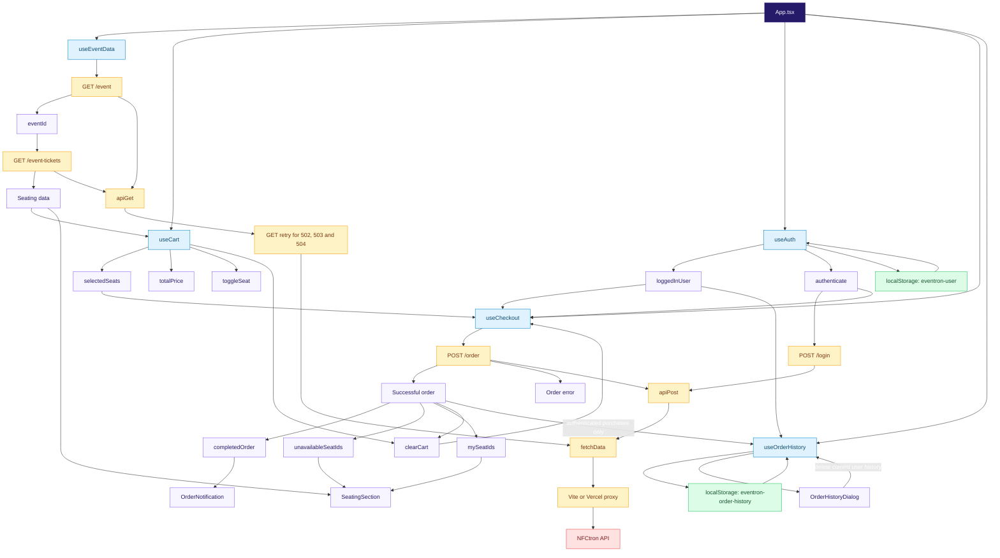
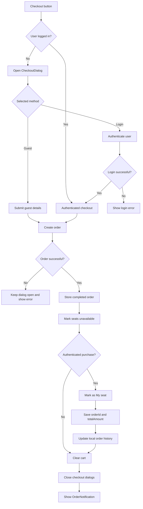

# EVENtron Application Architecture

The following diagrams show the runtime hierarchy and orchestration of the application from `main.tsx` down to feature components, hooks and API services.

## Component hierarchy

```mermaid
flowchart TD
    MAIN["main.tsx"] --> STRICT["React.StrictMode"]
    STRICT --> LANG["LanguageProvider"]
    LANG --> APP["App.tsx"]

    APP --> LOGIC["Application logic"]
    APP --> VIEW["Rendered interface"]

    LOGIC --> DATA["Data and cart"]
    LOGIC --> ACTIONS["User actions"]

    DATA --> EVENTHOOK["useEventData"]
    DATA --> CARTHOOK["useCart"]
    DATA --> HISTORYHOOK["useOrderHistory"]

    ACTIONS --> AUTHHOOK["useAuth"]
    ACTIONS --> CHECKOUTHOOK["useCheckout"]
    ACTIONS --> SCROLLHOOK["useScrollState"]

    VIEW --> PAGE["Page layout"]
    VIEW --> OVERLAYS["Overlay layer"]

    PAGE --> HEADER["Header"]
    PAGE --> CONTENT["Main content"]
    PAGE --> FOOTER["Footer"]
    PAGE --> SCROLLBUTTON["ScrollToTopButton"]

    HEADER --> LOGO["Logo"]
    HEADER --> TRANSLATE["TranslateButton"]
    HEADER --> CARTBUTTON["CartButton"]
    HEADER --> USERMENU["User menu"]

    USERMENU --> LOGINBUTTON["Login button"]
    USERMENU --> AVATAR["Avatar dropdown"]

    AVATAR --> HISTORYACTION["Order history action"]
    AVATAR --> PROFILEACTION["Profile action"]
    AVATAR --> LOGOUTACTION["Logout action"]

    HISTORYACTION --> HISTORYICON["OrderHistoryIcon"]

    CONTENT --> SEATING["SeatingSection"]
    CONTENT --> EVENT["EventSection"]

    SEATING --> STAGE["SeatingStage"]
    SEATING --> SEATCONTENT["Seat content state"]
    SEATING --> LEGEND["SeatingLegend"]

    SEATCONTENT --> SEATLOADING["Spinner"]
    SEATCONTENT --> SEATERROR["ErrorMessage"]
    SEATCONTENT --> MAP["SeatingMap"]

    MAP --> ROWS["Seat rows"]
    ROWS --> POSITIONS["Seat positions"]

    POSITIONS --> AVAILABLE["Available Seat"]
    POSITIONS --> UNAVAILABLE["Unavailable seat"]
    POSITIONS --> MYSEAT["My seat"]

    AVAILABLE --> POPOVER["Seat Popover"]
    POPOVER --> TICKETINFO["Ticket type and price"]
    POPOVER --> TOGGLE["Add or remove seat"]

    EVENT --> EVENTCONTENT["Event content state"]
    EVENT --> CALENDAR["AddToCalendar"]

    EVENTCONTENT --> EVENTLOADING["Spinner"]
    EVENTCONTENT --> EVENTERROR["ErrorMessage"]
    EVENTCONTENT --> DETAILS["EventDetails"]

    DETAILS --> IMAGE["Event image"]
    DETAILS --> DESCRIPTION["Name and description"]
    DETAILS --> DATETIME["Dates and venue"]

    CALENDAR --> CALENDARMENU["Calendar dropdown"]
    CALENDARMENU --> GOOGLE["Google"]
    CALENDARMENU --> OUTLOOK["Outlook"]
    CALENDARMENU --> OFFICE["Office 365"]
    CALENDARMENU --> YAHOO["Yahoo"]
    CALENDARMENU --> ICS["ICS download"]

    FOOTER --> FOOTERLOGO["Logo"]
    FOOTER --> PROJECTINFO["Project information"]
    FOOTER --> LINKS["External links"]

    OVERLAYS --> NOTIFICATIONS["Notifications"]
    OVERLAYS --> DIALOGS["Dialogs"]

    NOTIFICATIONS --> AUTHNOTICE["AuthNotification"]
    NOTIFICATIONS --> ORDERNOTICE["OrderNotification"]

    DIALOGS --> CARTDIALOG["CartDialog"]
    DIALOGS --> CHECKOUTDIALOG["CheckoutDialog"]
    DIALOGS --> LOGINDIALOG["LoginDialog"]
    DIALOGS --> PROFILEDIALOG["ProfileDialog"]
    DIALOGS --> HISTORYDIALOG["OrderHistoryDialog"]

    CARTDIALOG --> CARTSUMMARY["CartSummary"]
    CARTSUMMARY --> REMOVESEAT["Remove seat"]

    CHECKOUTDIALOG --> GUESTFORM["Guest form"]
    CHECKOUTDIALOG --> CHECKOUTLOGIN["Login form"]

    HISTORYDIALOG --> HISTORYLIST["Stored orders"]
    HISTORYDIALOG --> CLEARHISTORY["Delete history"]

    classDef entry fill:#25196a,color:#fff,stroke:#25196a;
    classDef provider fill:#ede9fe,color:#25196a,stroke:#7c3aed;
    classDef orchestration fill:#ddd6fe,color:#25196a,stroke:#7c3aed;
    classDef hook fill:#e0f2fe,color:#0c4a6e,stroke:#0284c7;
    classDef component fill:#f7f5ff,color:#25196a,stroke:#8b5cf6;
    classDef ui fill:#fafafa,color:#27272a,stroke:#a1a1aa;

    class MAIN entry;
    class STRICT,LANG provider;
    class APP,LOGIC,VIEW,DATA,ACTIONS,PAGE,OVERLAYS orchestration;
    class EVENTHOOK,CARTHOOK,HISTORYHOOK,AUTHHOOK,CHECKOUTHOOK,SCROLLHOOK hook;

    class HEADER,CONTENT,FOOTER,SEATING,EVENT,STAGE,LEGEND,MAP,ROWS,DETAILS,CALENDAR,NOTIFICATIONS,DIALOGS,AUTHNOTICE,ORDERNOTICE,CARTDIALOG,CHECKOUTDIALOG,LOGINDIALOG,PROFILEDIALOG,HISTORYDIALOG,CARTSUMMARY component;

    class LOGO,TRANSLATE,CARTBUTTON,USERMENU,LOGINBUTTON,AVATAR,HISTORYACTION,HISTORYICON,PROFILEACTION,LOGOUTACTION,SCROLLBUTTON,SEATCONTENT,SEATLOADING,SEATERROR,POSITIONS,AVAILABLE,UNAVAILABLE,MYSEAT,POPOVER,TICKETINFO,TOGGLE,EVENTCONTENT,EVENTLOADING,EVENTERROR,IMAGE,DESCRIPTION,DATETIME,CALENDARMENU,GOOGLE,OUTLOOK,OFFICE,YAHOO,ICS,FOOTERLOGO,PROJECTINFO,LINKS,REMOVESEAT,GUESTFORM,CHECKOUTLOGIN,HISTORYLIST,CLEARHISTORY ui;
```

## State and API orchestration

## Main checkout sequence

